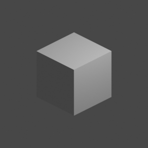

# Template (Put the human-readable name of your model here)

Put a short description here. (one sentence should suffice)

## Preview



Attach a preview image of the model (max 500x500 pixels). For example, you can use the render output of `dim_camera_45`.

## Summary

Summarize the status of the model, e.g. whether its textures, meshes, animations or compositing are finished or need more work.

**Meshes**

Mesh           | Status          | Description
---------------|-----------------|---------------
Unit body      | Done            | -
Shield         | Done            | -
Spear          | WIP             | Tip is not perfect yet

**Textures**

Mesh           | Status          | Description
---------------|-----------------|---------------
Unit body      | WIP             | Cloth needs to be textured
Shield         | Done            | -
Spear          | Missing         | Spear mesh needs to be remade

**Animations**

Animation      | Status          | Description
---------------|-----------------|---------------
Idle           | Done            | -
Move           | Done            | -
Attack         | Missing         | Spear mesh needs to be modelled
Die            | Done            | -
Decay          | Missing         | -

**Compositing**

Composite      | Status          | Description
---------------|-----------------|---------------
Shadows        | WIP             | Needs more sharpening
Color palette  | WIP             | Tweaking the colors

These are just examples and can be replaced or extended based on what you prefer. However, this section should provide only a quick technical overview.

## Description

Explain the model represents (e.g. a skirmisher from AoE2) and what it is used for (e.g. a replacement asset for openage).

You can explain things about the model here. What methods did you use, why you did things the way they are, what was your process of thought? Anything that's important to know about the model should be explained here.

## Credit

Your name, the names of your co-authors and, if you used another Creative Commons model as a basis, the names of the original authors with links to the original model.

You can also put links to your personal site or donation platform here.

## License

The license notification. Copy and paste the content below into this section:

```
Data in this repository is licensed under the
[Creative Commons Attribution-ShareAlike 4.0 International License](http://creativecommons.org/licenses/by-sa/4.0/)
or any later version.


Code in this repository is licensed under the [GNU GPLv3](https://www.gnu.org/licenses/gpl-3.0.en.html)
or any later version.
```
